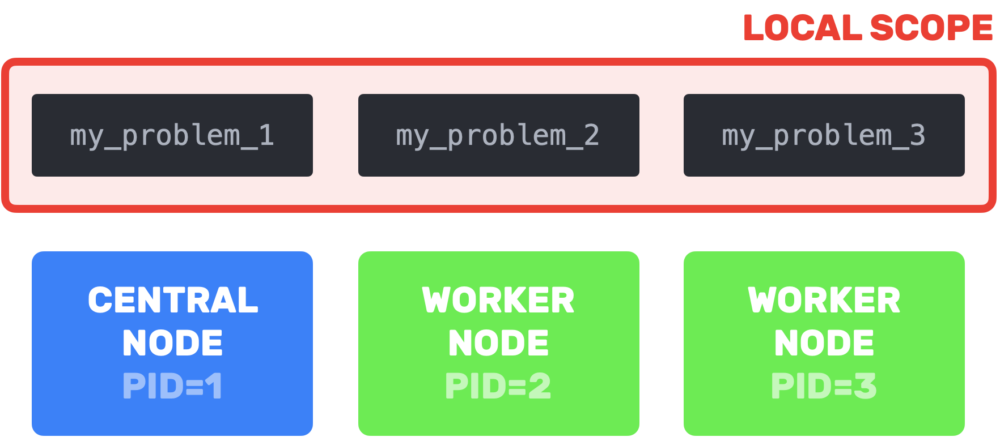
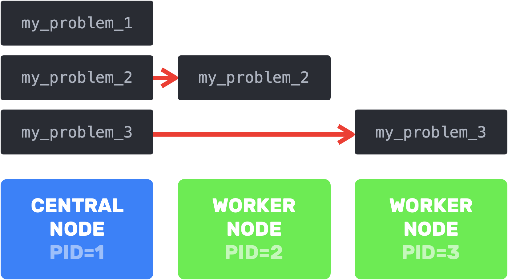
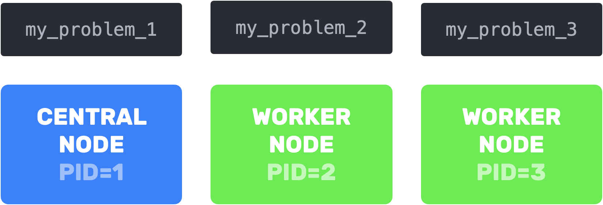

# Manual

  - [Working with a distributed problem](#working-with-a-distributed-problem)
  - [Synchronous run](#synchronous-run)
  - [Active processes](#active-processes)
  - [Recording iterates](#recording-iterates)
  - [Custom stopping criterion](#custom-stopping-criterion)
  - [`start` vs `start!`](#start-vs-start)
  - [Handling worker failures](#handling-worker-failures)
  - [Algorithm templates](#algorithm-templates)

## Working with a distributed problem

Suppose you have a `make_problem` function

```julia
# Note: In this example we sample `A` and `b`. 
# In practice, we could read them from a file or any other source.
@everywhere function make_problem(pid)
    pid==1 && return nothing # for now, let's assign process 1 an empty problem
    LRMSE(rand(pid,10),rand(pid)) # the sample size is `m` is set to `pid` for demonstration purposes only
end
```

When instanciating your problems you might have three requirement:

- **Limiting comunication costs** and **avoiding duplicated memory**: loading problems directly on their assigned processes is be preferable to loading them central node before sending them to their respective processes
- **Persistant data**: necessary if you want to reuse problems for multiple experiments (you don't want your problems to be stuck on  remote processes in `start`'s local scope)

Depending on your needs, you have three options to construct your problems:

```julia
# Option 1: Instantiate the problems remotely
problem_constructor = make_problem 

# Option 2: Instantiate the problems on the central node and send them to their respective processes
problems = Dict(procs() .=> make_problem.(procs()));
problem_constructor = (pid) -> problems[pid]

# Option 3: Create a `DistributedObject` that references a problem on each process. 
@everywhere using DistributedObjects
distributed_problem = DistributedObject((pid) -> make_problem(pid), pids=procs())
```
> Option 3 uses [`DistributedObjects`](https://github.com/Selim78/DistributedObjects.jl). In a nutshell, a `DistributedObject` instance references at most one object per process, and you can access the object stored on the current process with `[]`


|  | communication costs & duplicated memory 	| single use objectives 	|  	|
|---	|:---:	|:---:	|---	|
| Option 1 	|  	| ❌ 	|  	|
| Option 2 	| ❌ 	|  	|  	|
| Option 3 	|  	|  	|  	|

As previously noted, Option 2 should be avoided when working with large data. However, it does offer the advantage of preserving access to problems, which is not possible with Option 1. This opens up the possibility of reconstructing the global problem.

```julia
# reconstructing global problem from problems storred locally
function LRMSE(problems::Dict)
    pids = [pid for pid in keys(problems) if pid ≠ 1]
    n = problems[pids[1]].n
    m = sum([problems[pid].m for pid in pids])
    L = sum([problems[pid].L for pid in pids])
    ∇f(x) = sum([problems[pid].∇f(x) * problems[pid].m for pid in pids]) / m
    return LRMSE(nothing,nothing,n,m,L,∇f)
end

problems[1] = LRMSE(problems);
# We now have access to the global Lipschitz constant!
sgd = SGD(1/problems[1].L)
```

*Option 3* is the best of both worlds:

```julia
# reconstructing global problem from problems storred remotely 
function LRMSE(d::DistributedObject)
    pids = [pid for pid in where(d) if pid ≠ 1]
    n = fetch(@spawnat pids[1] d[].n)
    m = sum(fetch.([@spawnat pid d[].m for pid in pids]))
    L = sum(fetch.([@spawnat pid d[].L for pid in pids]))
    ∇f(x) = sum(fetch.([@spawnat pid d[].∇f(x) * d[].m for pid in pids])) / m
    return LRMSE(nothing,nothing,n,m,L,∇f)
end

distributed_problem[] = LRMSE(distributed_problem);
# We also have access to the global Lipschitz constant!
sgd = SGD(1/distributed_problem[].L)
```

It's worth mentioning that instead of `problem_constructor::Function`, `distributed_problem::DistributedObject` can be passed to [`start`](@ref). Both of the following are equivalent:

```julia
history = start(sgd, (pid)-> distributed_problem[], stopat)
history = start(sgd, distributed_problem, stopat);
```

## Synchronous run

If you want to run your algorithm synchronously you just have to define the **synchronous central step** performed by the central node when receiving a answers `as::Vector{A}` from all the `workers`...

```julia
@everywhere begin
    # synchronous central step
    (sgd::SGD)(as::Vector{Vector{Float64}}, workers::Vector{Int64}, problem::Any) = sum(as)
end
```

...and to add the `synchronous=true` keyword to [`start`](@ref)

```julia
history = start(sgd, distributed_problem, stopat; synchronous=true);
```

## Active processes

You can chose which processes are active with the `pids` keyword

```julia
history = start(sgd, problem_constructor, stopat; pids=[2,3,6]);
```

If `pids=[1]`, a non-distributed (and necessarily synchronous) version of your algorithm will be `start`ed.

```julia
history = start(sgd, (pid)->LRMSE(rand(42,10),rand(42)), stopat; pids=[1], synchronous=true);
```

## Recording iterates

The queries`::Q` sent by the central node are saved at intervals specified by saveat=(iterations, epochs).

```julia
history = start(sgd, distributed_problem, stopat; saveat=(10,0));
```
To also save the workers' answers`::A`, simply add the `save_answers=true` keyword.

```julia
history = start(sgd, distributed_problem, stopat; saveat=(10,0), save_answers=true);
```

## Custom stopping criterion

To augment the default `stopat=(iteration, epoch, time)` with an additional stopping criterion, follow these steps:

1. Define a new method `AsynchronousIterativeAlgorithms.stopnow` to be dispatched when called on your algorithm.
2. Declare that your algorithm implements the `Stoppable` trait.

As an example, let's modify the `SGD` example to include a *precision* criterion.

```julia
@everywhere begin
    using LinearAlgebra

    mutable struct CustomSGD<:AbstractAlgorithm{Vector{Float64},Vector{Float64}}
        stepsize::Float64
        previous_q::Vector{Float64}
        gap::Float64 # will hold the distance between the last two iterates
        precision::Float64
        CustomSGD(stepsize::Float64, precision) = new(stepsize, Vector{Float64}(), 10^6, precision)
    end
    
    function (sgd::CustomSGD)(problem::Any) 
        sgd.previous_q = rand(problem.n)
    end
    
    function (sgd::CustomSGD)(q::Vector{Float64}, problem::Any)
        sgd.stepsize * problem.∇f(q, rand(1:problem.m))
    end
    
    function (sgd::CustomSGD)(a::Vector{Float64}, worker::Int64, problem::Any) 
        q = sgd.previous_q - a 
        sgd.gap = norm(q-sgd.previous_q)
        sgd.previous_q = q
    end

    # Stop when gap is small enough
    AIA.stopnow(sgd::CustomSGD) = sgd.gap ≤ sgd.precision
    AIA.Stoppability(::CustomSGD) = Stoppable()    
end

history = start(CustomSGD(0.01, 0.1), distributed_problem, (10,0,0.));
```

> This was only meant to be an example as in practice you can specify a precision threshold by passing a fourth value in `stopat`. To use a custom distance function instead of the default `(x,y)->norm(x-y)`, provide the desired function through the `distance` keyword of `start`.

```julia
history = start(CustomSGD(0.01, 0.1), distributed_problem, (10,0,0.,0.1); distance=(x,y)->norm(x-y,1));
```

## [`start`](@ref) vs [`start!`](@ref)

`start` uses a deep copy of your algorithm and won't modify it. To enable modifications (e.g. to record information during the execution), use `start!`.

## Handling worker failures

If you expect some workers to fail but still want the algorithm to continue running, you can set the `resilience` parameter to the maximum number of worker failures you can tolerate before the execution is terminated.

## Algorithm templates

You are free to create your own algorithms, but if you're interested in *aggregation algorithms*, you can use an implementation provided in this library. The iteration of such an algorithm performs the following computation:

$$q_j \longleftarrow \textrm{query}(\underset{i \in \textrm{connected}}{\textrm{aggregate}}(a_j))\ \ \textrm{where }\ \ a_i = \textrm{answer}(q_i)$$

where $q_j$ is computed by the worker upon reception of $\textrm{answer}(q_i)$ from worker $j$ and where $connected$ are the list of workers that have answered.

The [`AggregationAlgorithm`](@ref) in this library requires you to specify three methods: query, answer, and aggregate. Here's an example showing the required signatures of these three methods:


```julia
@everywhere begin 
    using Statistics

    function agg_gd(q0, stepsize)
        initialize(problem::Any) = q0
        aggregate(a::Vector{Vector{Float64}}, connected::Vector{Int64}) = mean(a)            
        query(a::Vector{Float64}, problem::Any) = a
        answer(q::Vector{Float64}, problem::Any) = q - stepsize * problem.∇f(q)   

        AggregationAlgorithm{Vector{Float64}, Vector{Float64}}(initialize, aggregate, query, answer; pids=workers())
    end
end 

history = start(agg_gd(rand(10), 0.01), distributed_problem, (1000,0,0.));
```

**Memory limitation:** At any point in time, the central worker should have access must have access to the latest answers $a_i$ from *all* the connected workers. This means storing a lot of $a_i$ if we use many workers. There is a workaround when the aggregation operation is an *average*. In this case only the equivalent of one answer needs to be saved on the central node, regardless of the number of workers.

[`AveragingAlgorithm`](@ref) implements this memory optimization. Here you only need to define `query`, the `answer`

```julia
@everywhere begin 
    # If you want the average to be weighted, you can add the keywords pids with their corresponding weights
    function avg_gd(q0, stepsize, pids=workers(), weights=ones(nworkers())) 
        initialize(problem::Any) = q0
        query(a::Vector{Float64}, problem::Any) = a
        answer(q::Vector{Float64}, problem::Any) =  q - stepsize * problem.∇f(q)
        AveragingAlgorithm{Vector{Float64}, Vector{Float64}}(initialize, query, answer; pids=pids, weights=weights)
    end
end

history = start(avg_gd(rand(10), 0.01), distributed_problem, (1000,0,0.));
```

Hope you find this library helpful and look forward to seeing how you put it to use!
